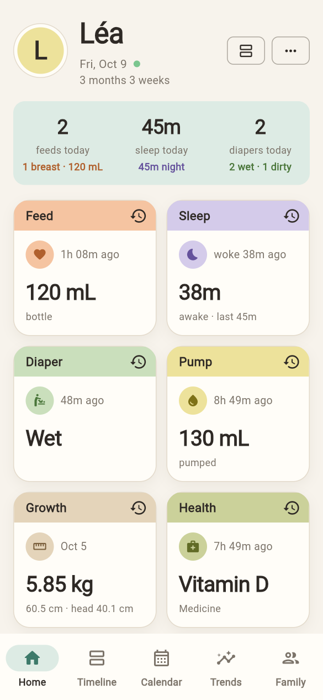
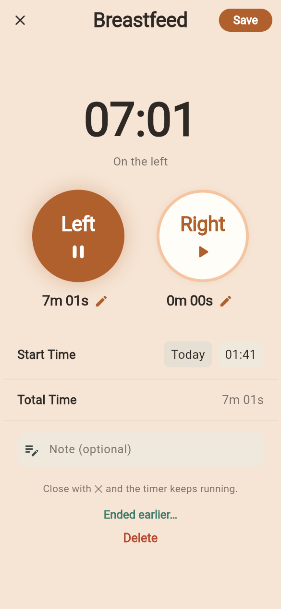
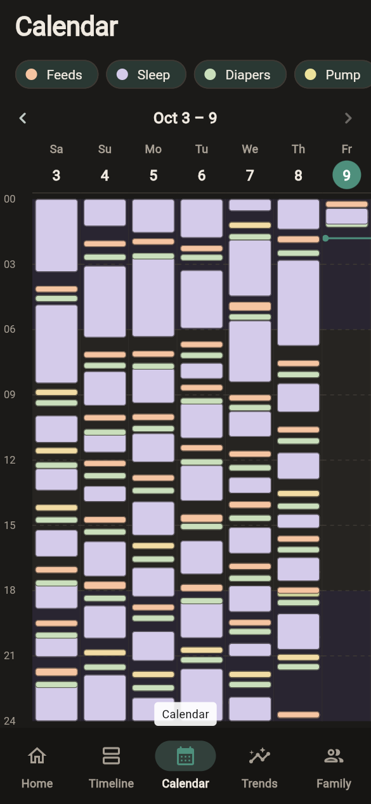
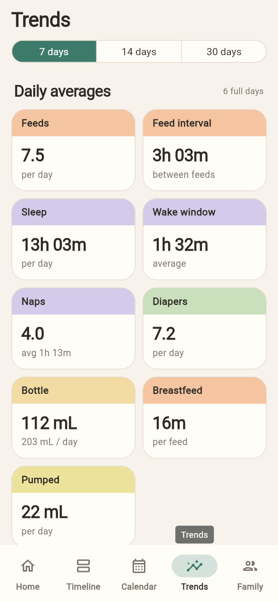

# Nestling

**A self-hosted baby tracker for the whole family.** Log feeds, sleep, diapers, pumping, growth
and health from any phone, see what the other caregivers logged a second later, and keep every
record on your own hardware.

Nestling is two parts that ship together:

- **The app** — a Flutter app for the web (installable as a PWA) and Android, built for one-handed
  use at 3 a.m.
- **The server** — a small Rust service with one SQLite file that stores everything, keeps
  caregivers in sync and serves the web app.

| Home | Live timer | Calendar | Trends |
|---|---|---|---|
|  |  |  |  |

## The app

One codebase ([`app/`](app/README.md)) for the browser and Android.

- **Home at a glance.** Today's totals (feeds with breast/bottle split, night sleep and naps,
  wet/dirty diapers) and a card per activity: time since the last one and what matters next
  ("last side: left", "awake 1h 20m", "130 mL pumped"). Tap a card to log.
- **Live timers.** Breastfeeding (left/right, switch, pause), sleep and pumping. Start on one phone,
  switch sides on the other. Correct the start time or any side's duration with a pencil; close the
  screen and the timer keeps running (on Android, a notification shows it with a live clock). The
  breastfeeding timer marks the side the last feed ended on, and **Continue** on a saved feed, pump
  or sleep picks it back up as a running timer.
- **Quick forms** for bottles, solids, diapers (color, consistency, rash, blowout), potty trips,
  growth, temperature, medicine, vaccines, routines and baby's firsts. Medicines, activities and
  foods are picked from your baby's past entries first, then a list of common ones, or typed in.
- **Timeline** of everything, grouped by day and filterable; tap any entry to edit it. A summary counts each type for today or the last 24 hours.
- **Calendar** with a column per day and a bar per entry: scroll back through weeks to see sleep
  and feeding patterns.
- **Growth charts**: weight, length and head size on the WHO percentile curves (birth to 24
  months), with each measurement's percentile.
- **Trends** over 7, 14 or 30 days: feeds per day, feed interval, sleep and naps, wake windows,
  diapers and potty trips, bottle and pumping volumes, each with the change since the period
  before, a day/night split (your family's daytime hours) and daily charts.
- **Family sharing.** Several babies (each with a profile picture) and caregivers per family;
  changes appear on every device within a second.
- **Yours to adjust.** Light and dark themes (or follow the system), metric or imperial units,
  24-hour clock.

## The server

A single Rust binary ([`src/`](src)) with an SQLite file — happy on a NAS, a Raspberry Pi or next
to Home Assistant.

- **Accounts.** The first account is the admin; admins create the other accounts (no public
  sign-up). Repeated wrong passwords are slowed down (per account and per address).
- **Families.** Any number of families, caregivers and children; invite codes to share a family.
- **JSON API** ([`docs/API.md`](docs/API.md), with an OpenAPI description in
  [`docs/openapi.yaml`](docs/openapi.yaml) for generating clients). Metric units everywhere (mL, g,
  cm, °C, seconds), times as `"now"`, local time or RFC 3339, one call per action.
- **Shared timers** stored on the server, so every caregiver sees the same running clock.
- **Live updates** over Server-Sent Events, plus `/sync` for clients that work offline: changes
  logged without a connection are pushed later and settled per record (newest change wins).
- **Daily statistics** (day/night split, naps, feed intervals) computed on the server, so every
  client shows the same numbers.
- **History import** from a previous tracker's CSV export, with a preview before anything is saved,
  and **CSV export** of everything in the same layout (it imports back without losing anything).
- **Home Assistant friendly.** Long-lived API tokens and a `/summary` endpoint for REST sensors.
- **Serves the web app** at `/`, so one container is the whole install.

```
 phones / browsers ──HTTPS──▶ reverse proxy ──▶ nestling (Rust) ──▶ nestling.db (SQLite)
   Flutter app                                    ├─ /           web app
   (web, Android)                                 ├─ /api/v1     JSON API + live updates
                                                  └─ /health
```

## Getting started

### 1. Run the server

```bash
git clone https://github.com/jfchenier/nestling && cd nestling
docker compose up -d --build
```

Or use the prebuilt image `ghcr.io/jfchenier/nestling:latest` (see
[Deploy with Portainer](#deploy-with-portainer)). The web app is now at `http://<your-server>:8080/`.

### 2. Create the admin account

Open the web app. A new server asks for its **admin account** first. Then create your family and
add your baby.

### 3. Add the other caregivers

As the admin, go to **Settings → Users → Add user**: name, email and a starting password, optionally
added straight to your family. They sign in and can change the password under Settings → Account.
(Someone who already has an account on the server can join with an invite code from
**Family → Invite a caregiver**.)

### 4. Put it on your phones

- **Any phone:** open the web app and choose **Add to Home screen** / **Install app**.
- **Android:** install the APK (see [`app/README.md`](app/README.md#android-app)) and enter your
  server's address on the sign-in screen.

Use HTTPS (Caddy, Traefik, Nginx Proxy Manager, Tailscale…) before opening it to the internet.

## Configuration

| Variable | Default | |
|---|---|---|
| `NESTLING_DATABASE_URL` | `sqlite://nestling.db` (`sqlite:///data/nestling.db` in Docker) | SQLite file |
| `NESTLING_BIND` | `0.0.0.0:8080` | Listen address |
| `NESTLING_WEB_DIR` | unset (`/web` in Docker) | Folder with the web app to serve at `/` |
| `NESTLING_OPEN_REGISTRATION` | `false` | Let anyone create an account (normally only admins do) |
| `NESTLING_FCM_CREDENTIALS` | unset | Firebase service-account key (JSON file) for [notifications on phones](#notifications-on-phones) |
| `NESTLING_FCM_APP_ID`, `NESTLING_FCM_API_KEY` | unset | The Firebase Android app's App ID and API key (same section) |
| `RUST_LOG` | `nestling=info,tower_http=info` | Log level |

## Running it

### Accounts and recovery

Admins manage accounts under **Settings → Users**: add users (standard or admin), set a new password
for someone who forgot theirs, promote or remove accounts. The server always keeps at least one
admin. If you lock yourself out, run this on the host:

```bash
docker exec <container> nestling set-password me@example.com 'a new password'
docker exec <container> nestling make-admin me@example.com
```

### Backups

Everything is in one file, `nestling.db`, in the `nestling-data` volume:

```bash
docker compose stop
docker run --rm -v nestling_nestling-data:/data -v "$PWD":/backup debian cp /data/nestling.db /backup/
docker compose start
```

### Deploy with Portainer

Every push to `main` publishes `ghcr.io/jfchenier/nestling:latest` (version tags add `:0.2.0`-style
tags). In Portainer: **Stacks → Add stack → Web editor**, paste
[`deploy/portainer-stack.yml`](deploy/portainer-stack.yml) (port 8383 → 8080, data in the
`nestling-data` volume) and deploy. To update, **Pull and redeploy** the stack.

### Behind a reverse proxy

Point your proxy host (e.g. `nestling.example.com`) at `http://<server>:8383`. Live updates use
Server-Sent Events, so turn off response buffering for them. With Nginx (or Nginx Proxy Manager →
Advanced):

```nginx
location /api/v1/families/ {
    proxy_pass http://<server>:8383;
    proxy_http_version 1.1;
    proxy_set_header Connection "";
    proxy_buffering off;
    proxy_cache off;
    proxy_read_timeout 1h;
}
```

The server sends a keep-alive every 15 s, so idle timeouts (Cloudflare's included) don't cut the
stream, and an `X-Accel-Buffering: no` header, which turns buffering off in Nginx by itself. Don't let the proxy cache the web app's files: the server already sends the right cache
headers, and every release gets new file URLs.

### Notifications on phones

Optional. With it, when a caregiver starts, pauses or stops a timer, the other caregivers' Android
phones show it in their notifications (with the live clock) even while the app is closed. Without
it, they see it as soon as they open the app. It also sends **reminders** ("no feed in 3 h",
"next dose of Tylenol can be given now") to the phones; they are set per baby with the medicine button on Home (Medicines
and reminders), and without notifications they only show on the app's home screen. It goes through Google's Firebase Cloud Messaging,
in a free Firebase project of your own:

1. At [console.firebase.google.com](https://console.firebase.google.com), create a project
   (Google Analytics isn't needed).
2. **Add app → Android**, package name `org.nestling.nestling`. Skip the `google-services.json`
   and SDK steps. In **Project settings → General**, under the Android app, copy the **App ID**
   (`1:…:android:…`) into `NESTLING_FCM_APP_ID`, and the **Web API key** into
   `NESTLING_FCM_API_KEY`.
3. **Project settings → Service accounts → Generate new private key**. Put the JSON file where the
   container can read it (e.g. in the data volume as `/data/firebase.json`) and set
   `NESTLING_FCM_CREDENTIALS=/data/firebase.json`. Keep this file private.
4. Restart the server. The log says `notifications to phones are on`; each phone registers the next
   time the app opens (and asks to allow notifications).

The messages carry the timer's or reminder's text (e.g. "Léa · Sleeping", "Léa · Vitamin D")
through Google's servers; nothing else leaves your server.

### Exporting your data

**Settings → Export data** downloads everything for the family as a CSV file (one row
per entry, readable in any spreadsheet). The same file imports back into Nestling.

### Bringing your history over

The import under **Settings** reads the CSV export of your previous tracker app. It shows a preview (date
range, number of records per type, anything skipped) before saving; re-importing the same file
updates entries instead of duplicating them.

### Home Assistant

Create a long-lived token (**Settings → API token**, or `POST /api/v1/me/tokens`) and use
`GET /api/v1/children/{id}/summary` as a REST sensor: time since the last feed, diaper and sleep,
running timers and today's totals.

## Development

```
app/         Flutter app (web + Android) — see app/README.md
src/         Rust server: routes/ (HTTP API), model.rs (event types), trends.rs (statistics)
migrations/  SQLite schema
tests/       end-to-end API tests
docs/        API reference (API.md, openapi.yaml), screenshots
deploy/      Portainer stack
```

```bash
# Server
cargo run --release                 # http://localhost:8080
cargo test

# App (needs Flutter 3.35+)
cd app && flutter run -d chrome     # enter http://localhost:8080 on the sign-in screen
```

CI (`.github/workflows/`) runs the Rust and Flutter tests on every push, publishes the Docker
image from `main`, and a `v*` tag builds a GitHub Release with the Android APK and the web app.

## Documentation

- [`app/README.md`](app/README.md) — the app: screens, design, building the web app and the APK,
  release signing.
- [`docs/API.md`](docs/API.md) — the server's HTTP API, for scripts and other clients.
- [`docs/openapi.yaml`](docs/openapi.yaml) — the same API as an OpenAPI 3.0 document (also served at
  `/api/v1/openapi.yaml`), for generating client code.

## License

[MIT](LICENSE).
